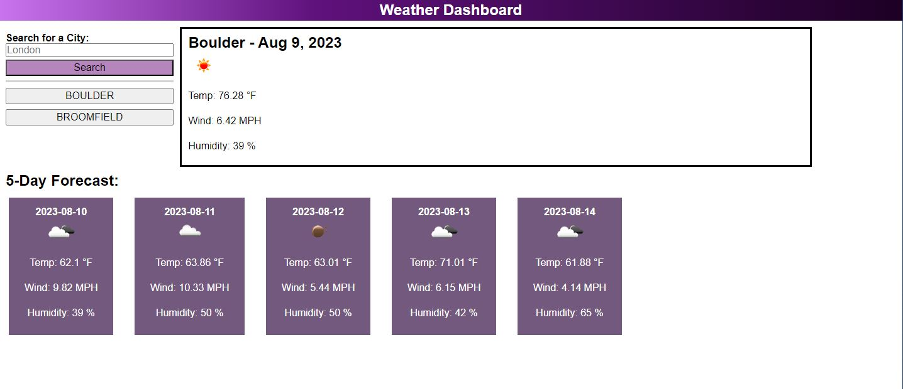

# Weather-Dashboard

## Description

This code creates a Weather Dashboard where you can search for any city and be presented with the current weather as well as the five day forecast. This webpage also saves your recent searches for easy access.

## Installation

N/A

## Usage

[link to landing page](https://raw.githack.com/Akleynhans/Weather-Dashboard/main/index.html)

 
Weather Dashboard showing the current weather and five day forecast for London.

## Credits

[link to find index of item in an array](https://herewecode.io/blog/replace-item-array-javascript/#:~:text=The%20Definitive%20Guide%22%20%7D-,If%20you%20want%20to%20replace%20an%20object%20in%20an%20array,not%20met%20in%20the%20array) 
[link to forEach() tutorial](https://developer.mozilla.org/en-US/docs/Web/JavaScript/Reference/Global_Objects/Array/forEach) 